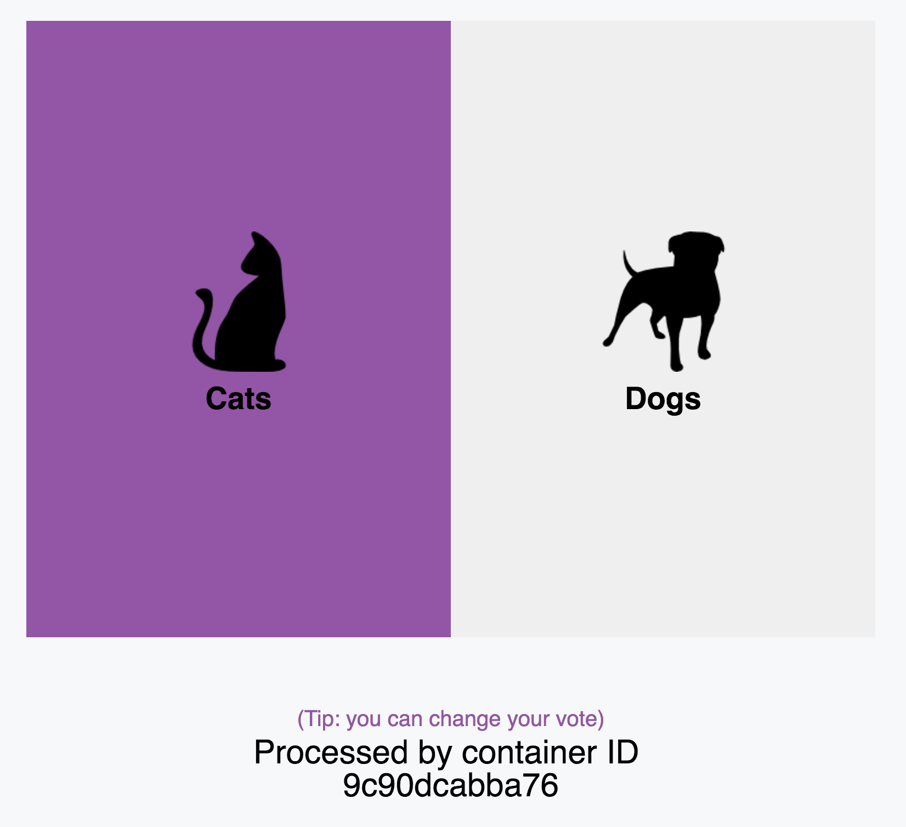
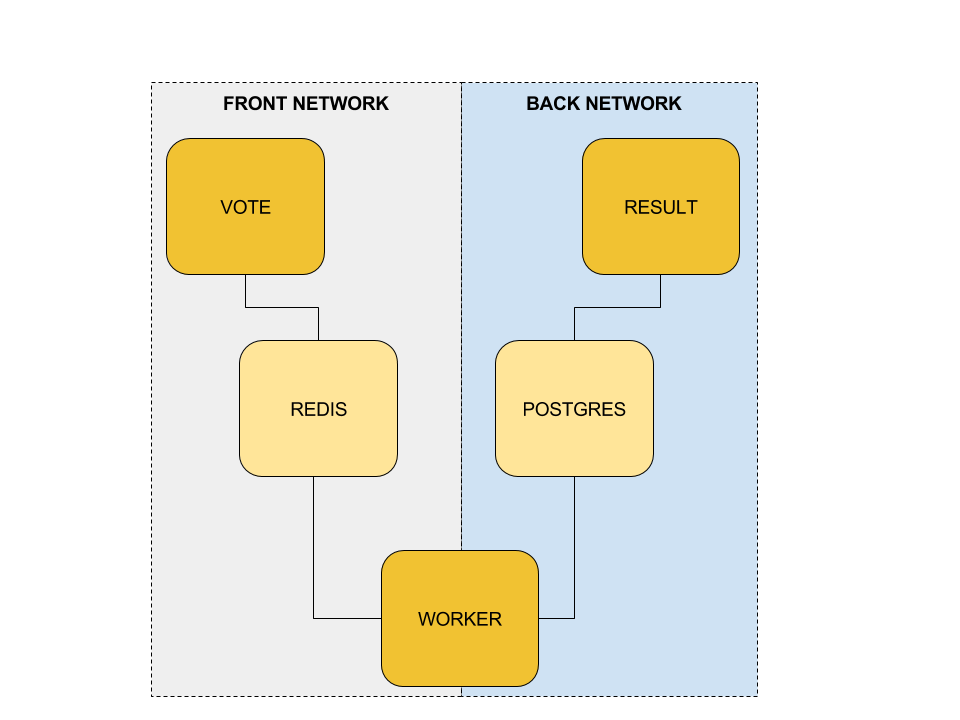

Example Voting App
=========

This application is a rewrite of [https://github.com/dockersamples/example-voting-app](https://github.com/dockersamples/example-voting-app)
We only use Java Vertx framework. In next releases, we will introduce other langages as Kotlin, Ceylon or JS.
At this day, it is a nice proof-of-concept with the awesome Vertx.

Getting started
---------------

Download [Docker](https://www.docker.com/products/overview). If you are on Mac or Windows, [Docker Compose](https://docs.docker.com/compose) will be automatically installed. On Linux, make sure you have the latest version of [Compose](https://docs.docker.com/compose/install/).
Original post comes from [there](https://github.com/docker/example-voting-app). We rewrote it with VertX.

Build the images in this directory:
```
mvn clean package docker:build
```

You should have a similar result with `docker images`:

```
 ✘ nicolas@MacBook > ~/software/vertx/vertx-voting-app > master > docker images 
REPOSITORY                              TAG                    IMAGE ID            CREATED             SIZE
vertxswarm/verticle-result             1.0-SNAPSHOT           ebeb1bb53f78        22 minutes ago      450 MB
vertxswarm/verticle-result             1.0-SNAPSHOT.27015db   ebeb1bb53f78        22 minutes ago      450 MB
vertxswarm/verticle-result             latest                 ebeb1bb53f78        22 minutes ago      450 MB
vertxswarm/verticle-worker             1.0-SNAPSHOT           fb702b8f68cf        40 minutes ago      440 MB
vertxswarm/verticle-worker             1.0-SNAPSHOT.27015db   fb702b8f68cf        40 minutes ago      440 MB
vertxswarm/verticle-worker             latest                 fb702b8f68cf        40 minutes ago      440 MB
vertxswarm/verticle-vote               1.0-SNAPSHOT           4b7a5532ba97        40 minutes ago      438 MB
vertxswarm/verticle-vote               1.0-SNAPSHOT.27015db   4b7a5532ba97        40 minutes ago      438 MB
vertxswarm/verticle-vote               latest                 4b7a5532ba97        40 minutes ago      438 MB
```

Run in this directory:
```
docker-compose up
```
The app will be running at:
* [http://localhost:8000](http://localhost:8000) 
* [http://localhost:8081](http://localhost:8081)

You can use too if you update your `/etc/hosts` 
* [http://vote.local](http://vote.local)
* [http://result.local](http://vote.local)



Docker Swarm
-----

Alternately, if you want to run it on a [Docker Swarm](https://docs.docker.com/engine/swarm/), first make sure you have a swarm. If you don't, run:

Follow this guide to provision a local but complete environment with tutorial [Local Docker Swarm](./SWARM.md).

You can directly use the [Shell script](./swarm-init.sh) 

```
docker-machine create --driver virtualbox poc-manager
docker-machine ssh poc-manager "docker swarm init --advertise-addr $(docker-machine ip poc-manager)"
docker-machine create --driver virtualbox poc-worker1
docker-machine create --driver virtualbox poc-worker2
docker-machine ssh poc-worker1 "docker swarm join --token `docker $(docker-machine config poc-manager) swarm join-token worker -q` $(docker-machine ip poc-manager)"
docker-machine ssh poc-worker2 "docker swarm join --token `docker $(docker-machine config poc-manager) swarm join-token worker -q` $(docker-machine ip poc-manager)"
```

Once you have your swarm, in this directory run:
```
docker stack deploy --compose-file docker-stack.yml demo
```


Architecture
-----



* A **verticle** webapp which lets you vote between two options
* A Redis queue which collects new votes
* A **verticle** worker which consumes votes and stores them in…
* A Postgres database backed by a Docker volume
* A **verticle** webapp which shows the results of the voting in real time

Technical choice
-----

We choose to use these Maven plugin :

For Verticle vote 

* [Docker Spotify](https://github.com/spotify/docker-maven-plugin) 
* [Git Project13](https://github.com/ktoso/maven-git-commit-id-plugin)

For Verticle worker
* [Docker Spotify](https://github.com/spotify/docker-maven-plugin) 
* [Git Project13](https://github.com/ktoso/maven-git-commit-id-plugin)

For Verticle result

* [Docker Spotify](https://github.com/spotify/docker-maven-plugin) 
* [Git Project13](https://github.com/ktoso/maven-git-commit-id-plugin)

In a near future, we will update  too :
- [ ] [Fabric8 Docker](https://github.com/fabric8io/docker-maven-plugin)
- [ ] [Fabric8 Vertx](https://vmp.fabric8.io/)
- [ ] [frontend Maven plugin](https://github.com/eirslett/frontend-maven-plugin)

Note
----

The voting application only accepts one vote per client. It does not register votes if a vote has already been submitted from a client.

Thanks to
----
Greetings to:
* Vertx team 
* Guillaume Borg (from Treeptik)

